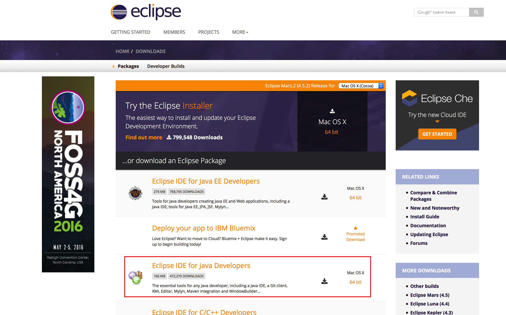
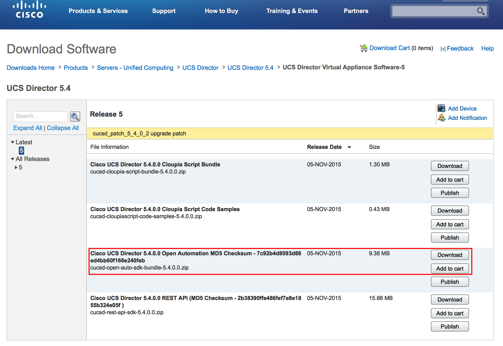
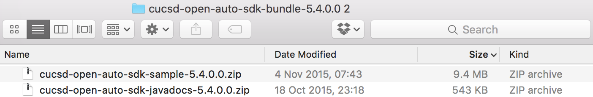
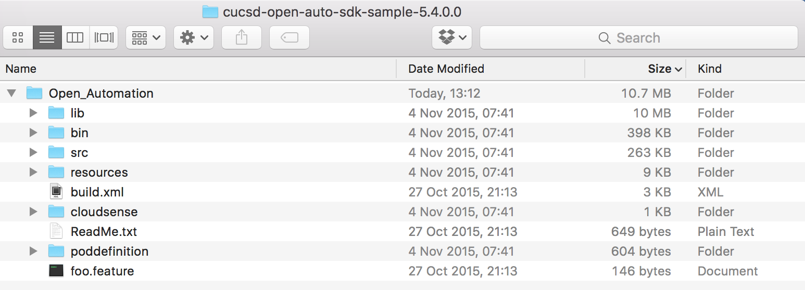

Getting Started
===============

To start will we will run though how to setup your development environment and build the example dummy plugin that is on the Cisco download site for UCS Director.

.. note:: Make sure that you pull the dummy example for the version of UCSD you are running!

The task that we will run thorugh with you are;

* Getting started and setting up Eclipse
* Importing dummy SDK into Eclipse
* Build Dummy SDK
* Import Dummy SDK & Enable
* Check Dummy SDK loaded (inluding logging info)

If you are already using a Java IDE and happy with the process to build and import plugins skip ahead.

Setting up Environment
------------------

Downloads
~~~~~~~~~

The first think to do is `download Eclipse <https://eclipse.org/downloads/>`_ for the operating system that you use. The one we used was 'Eclipse IDE for Java Developers'.

Once downloaded follow the instalation instruction, we won't go through these here.

Now you should download the UCS Director Dummy Plugin for your version from `Cisco CCO <https://software.cisco.com/download/release.html?mdfid=286290596&softwareid=285018084&release=5&relind=AVAILABLE&rellifecycle=&reltype=latest>`_. The file that you are looking for is `cucsd-open-automation-sdk-bundle-<ver>.zip`.

The download will contain two zip's

The first is the sample, or dummy, open automation code while the second is the Javadocs that we will use to enhance Eclipse.

If you unzip and browse the 'sample' zip you should see something similar to this;

Eclipse
~~~~~~~
As we ae using GitHub to share and collaborate on the examples we create the `Eclipse EGit plugin <http://www.eclipse.org/egit/>`_ was added to our environment. This is optional.

Setup Project
~~~~~~~~~~~

Now that we have an IDE and the sample open automation code downloded we need to import it into an Eclipse workspace.

import project
java versions - JRE 1.8
Set Java compiler to JRE 1.8
java docs

Build Project
----------------

Import to UCS Dirctor
----------------

Import plugin
~~~~~~~~~~~~~

Enable plugin
~~~~~~~~~~~~~

Debug import
~~~~~~~~~~~~

Check Dummy SDK loaded (inluding logging info)

Vaidation
----------
Check it works
