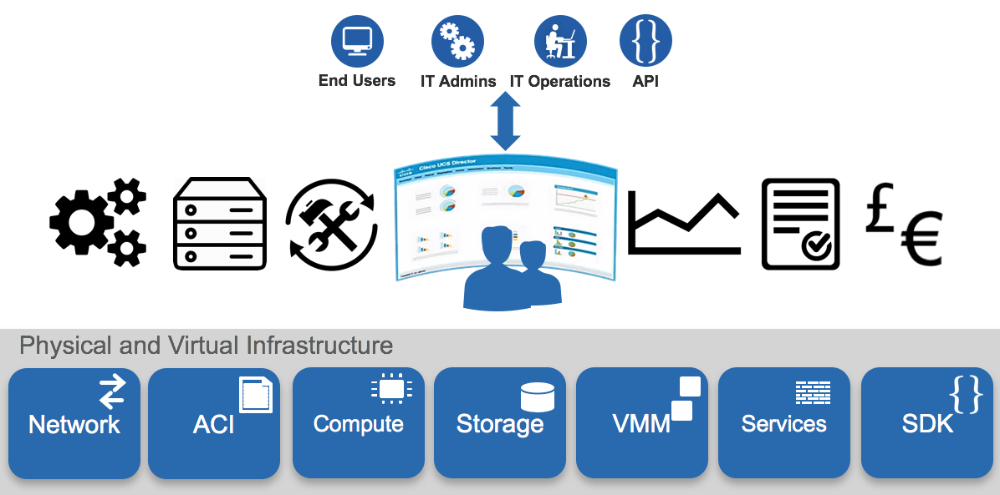
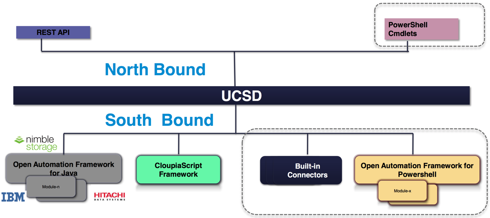
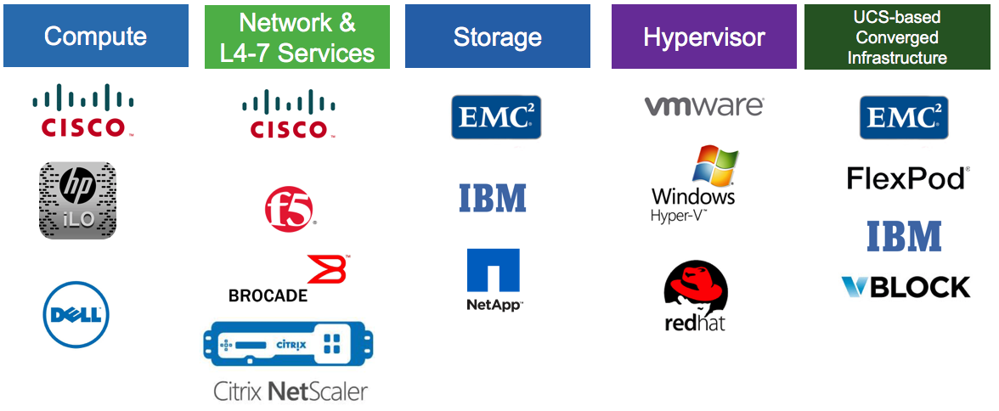

Introduction
============
.. note:: These pages are being built up at the moment and not complete, please treat them as a work in progress!

What is UCS Director?
---------------------
UCS Director is a tool to help you automate your data centre infrastructure (`Cisco Website <http://www.cisco.com/c/en/us/products/servers-unified-computing/ucs-director/index.html>`_). It abstracts hardware and software into programmable tasks that are assembled together to provision infrastructure across computing, networking and storage resources that reside on multiple hypervisor. The busines value is;

* Simplified infrastrucitre provisioning and managment that takes munites rather than weeks
* Pyhsical, virtaul and multi-vendor management from a single place to accomodate heterogeneous data centres
* Increased IT agility allowing IT to have greater impact on the effectiveness of the business.

The following image summarises the functionality of UCS Director;

The main call out feature are;

* Tasks and workflows - more than 2200 out of the box tasks (about 2400 person days of effort), these can be used to configure workflows that combine usful tasks into a single goal.
* Bare Metal - Assist with the provision and configuration of bare metal (PXE)
* LIfecycle Management - manage day to day tasks of the entire infrastruitre from a single place
* Metrics - Collects some preformance related metrics (NOT a perfromance management tool)
* Reports - Generate reports on the infrastruture
* Showback/chargeback - Tracks the usage of infrastructure resources to showback usage for groups (or extracted for billing engines)

It is possible to interact with UCS Director in multiple ways;

* Southbound
* Northbound

Access Northbound, access to the UCSD functioanlity, can be via the web GUI, RestAPI or Powershell Cmdlets (uses the RestAPI).

The Southbound access, communication to infrastruitre, can be achieved by one of these mechanisms;

* Built-in Connectors
* Powershell
* CloupiaScript
* Open Automation

The built-in connectors are the devices that are supported out of the box. These suported devices have automation tasks prebuilt and tested by Cisco. The official list of infrastructure supported by UCS Director is `here <http://www.cisco.com/c/en/us/support/servers-unified-computing/ucs-director/products-device-support-tables-list.html>`_.

Supported vendors;

Powershell support is via a powershell agenet and allos interaction with the underlying infrastrutre using powersehll functionality.

The CloupaScript framework allows you to create custom task (based around JavaScript) to interact with manged devices or it could be expanded to interacte with thinsg that are not managed in UCS Director. These taks are quick ways to expand the capbilities of UCS Director and many examples can be found on the `Cisco Communities site <https://communities.cisco.com/docs/DOC-56419>`_.

What is Open Automation?
------------------------

While the use of CloudpiaScripts and the Powershell agent makes UCS Director a big flexibe tool its southbound capabiliites don't end there, it also has the concept of 'Open Automation'. This can be used to make 3rd party devices look like they are nativly supported by UCSD by allowing you to;

* develop reports and report actions
* inventory devices
* track changes made to the system through the module
* develop task that can be used for workflows
* develop and scheulde repeatable tasks
* set up new resource limits

Open Automation is in essance a Java SDK that can be used to create a connector/plug-in that can be imported into UCSD.

The official Cisco documentation (always improving) for this can be found `here <http://www.cisco.com/c/en/us/support/servers-unified-computing/ucs-director/products-programming-reference-guides-list.html>`_.
